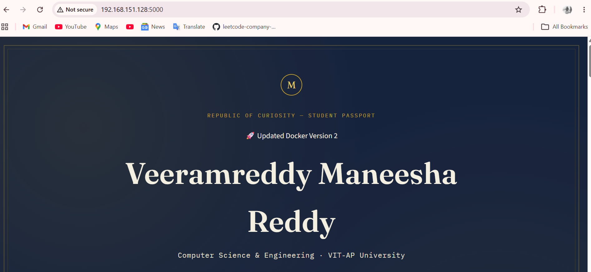
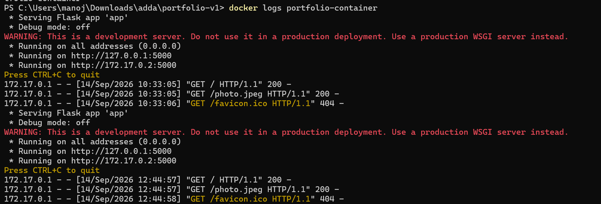
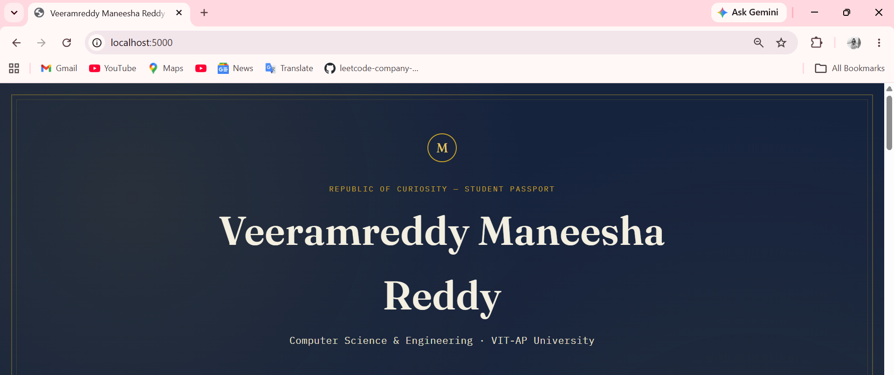
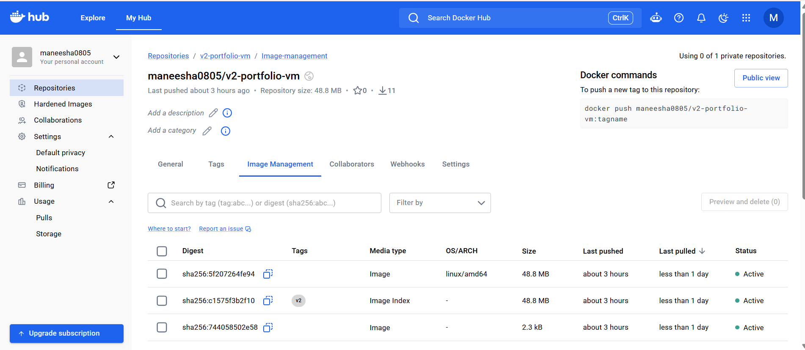
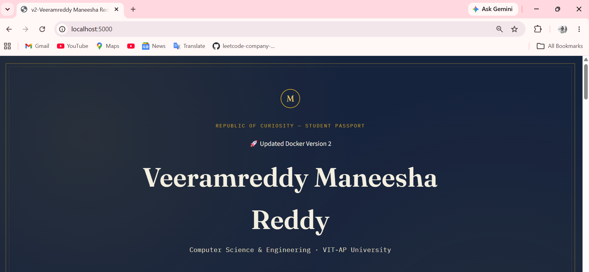

# Portfolio Web Application – Docker Containerization and VM Deployment

## 1. Application Name

**Portfolio Web Application**

This project is a personal portfolio web application that was containerized using Docker, versioned as `v2`, pushed to Docker Hub, and deployed on a separate Ubuntu Virtual Machine.

---

## 2. Technology Stack

* **Frontend:** HTML, CSS, JavaScript
* **Backend:** Python
* **Web Framework:** Flask
* **Containerization:** Docker
* **Container Registry:** Docker Hub
* **Virtual Machine:** Ubuntu VM
* **VM Platform:** VMware
* **Version Control:** Git and GitHub

---

## 3. Dockerfile

The Dockerfile is used to create a Docker image for the portfolio web application.

### Dockerfile

```dockerfile
FROM python:3.12-slim

WORKDIR /app

# Copy requirements first to leverage Docker cache
COPY source-code/requirements.txt .
RUN pip install --no-cache-dir -r requirements.txt

# Copy application code (backend + frontend)
COPY source-code/app.py .
COPY source-code/static/ static/

# Initialize the database on container start and run the app
CMD python app.py
```

### Explanation of Important Dockerfile Instructions

#### `FROM python:3.12-slim`

Uses the lightweight Python 3.12 Slim image as the base image for the application.

#### `WORKDIR /app`

Creates and sets `/app` as the working directory inside the Docker container.

#### `COPY source-code/requirements.txt .`

Copies the `requirements.txt` file from the project into the container.

#### `RUN pip install --no-cache-dir -r requirements.txt`

Installs all Python dependencies required by the application. The `--no-cache-dir` option avoids storing the pip cache and helps keep the image smaller.

#### `COPY source-code/app.py .`

Copies the main Python application file into the Docker container.

#### `COPY source-code/static/ static/`

Copies the application's static files such as CSS, JavaScript, images, and other frontend resources into the container.

#### `CMD python app.py`

Starts the Python application when the Docker container is launched.

---

## 4. Docker Build Command

The Docker image was built using the following command:

```bash
docker build -t portfolio:v2 .
```

The image was then checked using:

```bash
docker images
```

---

## 5. Docker Run Command

The portfolio application was run locally using:

```bash
docker run -d --name portfolio-container -p 5000:5000 portfolio:v2
```

The `-p 5000:5000` option maps port `5000` of the host machine to port `5000` of the Docker container.

For deployment on the Ubuntu VM, the Docker Hub image was run using:

```bash
sudo docker run -d --name portfolio-v2 -p 5000:5000 maneesha0805/v2-portfolio-vm:v2
```

---

## 6. Docker Image Name and Version

The local Docker image is:

```text
portfolio:v2
```

The Docker Hub image is:

```text
maneesha0805/v2-portfolio-vm:v2
```

The `v2` tag represents the modified version of the portfolio application.

---

## 7. Docker Hub Repository

The Docker Hub repository used for this project is:

**maneesha0805/v2-portfolio-vm**

The `v2` image was pushed to Docker Hub using:

```bash
docker push maneesha0805/v2-portfolio-vm:v2
```

The image was successfully uploaded to Docker Hub.

The image was later pulled onto the Ubuntu VM using:

```bash
sudo docker pull maneesha0805/v2-portfolio-vm:v2
```

---

## 8. Application URL

The application was deployed on a separate Ubuntu Virtual Machine.

The VM IP address used was:

```text
192.168.151.128
```

The application was accessed using:

```text
http://192.168.151.128:5000
```

The application was also tested from inside the Ubuntu VM using:

```bash
curl http://localhost:5000
```

The application returned the webpage successfully.

---

## 9. Changes Made in Version v2

A visible UI/functional modification was made to the original portfolio application to create Version 2.

The modified source code was rebuilt into a new Docker image and tagged as:

```text
portfolio:v2
```

The v2 image was then tagged with the Docker Hub repository name:

```text
maneesha0805/v2-portfolio-vm:v2
```

The modified v2 image was pushed to Docker Hub and deployed on a separate Ubuntu VM.

The final v2 modification can be verified in:

```text
screenshots/v2.png
```

---

## 10. VM Deployment Details

The final version of the application was deployed on a separate Ubuntu Virtual Machine using VMware.

### Step 1: Pull the Docker Image

The v2 image was pulled from Docker Hub:

```bash
sudo docker pull maneesha0805/v2-portfolio-vm:v2
```

### Step 2: Verify the Docker Image

The downloaded image was checked using:

```bash
sudo docker images
```

The following image was available:

```text
maneesha0805/v2-portfolio-vm:v2
```

### Step 3: Run the Docker Container

The application was started using:

```bash
sudo docker run -d --name portfolio-v2 -p 5000:5000 maneesha0805/v2-portfolio-vm:v2
```

### Step 4: Verify the Running Container

The running container was checked using:

```bash
sudo docker ps
```

The container was running with port mapping:

```text
0.0.0.0:5000->5000/tcp
```

### Step 5: Test the Application

The application was tested from inside the Ubuntu VM:

```bash
curl http://localhost:5000
```

The application responded successfully.

### Step 6: Access the Application

The application was accessed from a web browser using:

```text
http://192.168.151.128:5000
```

The modified Version 2 portfolio application was displayed successfully.

---

## 11. Screenshot of the Running Application

The final Version 2 application running on the Ubuntu VM is shown below:



The screenshot demonstrates that the modified v2 application was successfully deployed and accessed through the Ubuntu VM IP address.

---

## 12. Complete Containerization and Deployment Process

The complete process followed in this project is shown below:

```text
Portfolio Source Code
        |
        v
     Dockerfile
        |
        v
   Docker Build
        |
        v
    portfolio:v2
        |
        v
 Docker Tag
        |
        v
maneesha0805/v2-portfolio-vm:v2
        |
        v
    Docker Hub
        |
        | docker pull
        v
    Ubuntu VM
        |
        v
  Docker Container
        |
        | Port 5000
        v
    Web Browser
```

### Process Explanation

1. The portfolio web application source code was prepared.
2. A Dockerfile was created to containerize the application.
3. The Docker image was built using the Docker build command.
4. The application was tested locally inside a Docker container.
5. A visible UI/functional modification was made to create Version 2.
6. The modified application was rebuilt and tagged as `portfolio:v2`.
7. The v2 image was tagged using the Docker Hub repository name.
8. The v2 Docker image was pushed to Docker Hub.
9. A separate Ubuntu Virtual Machine was started using VMware.
10. Docker was installed and configured on the Ubuntu VM.
11. The v2 image was pulled from Docker Hub onto the VM.
12. The downloaded image was verified using `docker images`.
13. The v2 image was run as a Docker container.
14. Port `5000` was mapped between the VM and the Docker container.
15. The running container was verified using `docker ps`.
16. The application was tested using `curl http://localhost:5000`.
17. The VM IP address was used to access the application from a web browser.
18. The modified v2 version was successfully displayed.

---

## Project Structure

```text
docker-portfolio-deployment/
│
├── source-code/
│   ├── app.py
│   ├── requirements.txt
│   └── static/
│       └── ...
│
├── Dockerfile
│
├── README.md
│
└── screenshots/
    ├── docker hub.png
    ├── docker images-v1.png
    ├── docker images-v2.png
    ├── docker logs-v2.png
    ├── docker logs-v1.png
    ├── running container v1.png
    ├── running container v2.png
    ├── v1.png
    ├── v2.png
    └── vm.png
```

---

## Screenshots

### Docker Build




### Docker Images


### Docker Container


### Version 1 Application



### Docker Hub



### Version 2 Application



---

## Conclusion

The Portfolio Web Application was successfully containerized using Docker and versioned as `v2`. The v2 Docker image was pushed to Docker Hub and transferred to a separate Ubuntu Virtual Machine. The image was pulled and deployed as a Docker container, with port `5000` mapped for web access. The final modified v2 application was successfully verified through the VM IP address.
